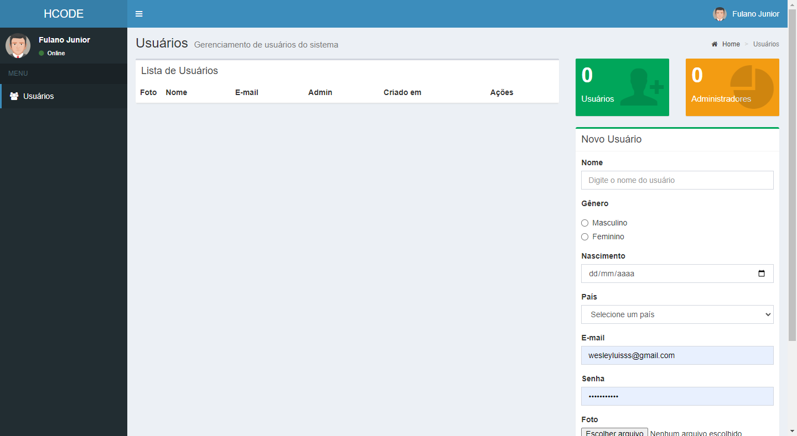

# Gerenciamento de usuarios´

Gerenciamento de usuários desenvolvido no curso de Javascript da hcode.

> BACKEND

## 🔨 TECNOLOGIAS

* NodeJS
* GIT & GITHUB
* JavaScript
* NeDB

> FRONTEND

## 🔨 TECNOLOGIAS

* NodeJS
* GIT & GITHUB
* JavaScript
* Restify

## Home

